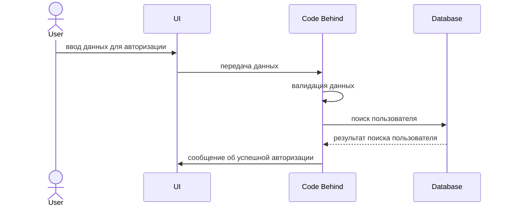

# Tour_Midili

<h2>Автор: Мидили Н.О. ИП-20-3<br />
  
<h2>Схема моделей:</h2>


                                                                                                         
<h2>Диаграмма последовательности процесса авторизации:</h2>
  


<h2>SQL скрипт по добавлению начальных данных:<br /></h2>

``` sql
GO
INSERT [dbo].[Countries] ([Code], [Name]) VALUES (N'AD', N'Andorra')
INSERT [dbo].[Countries] ([Code], [Name]) VALUES (N'AE', N'United Arab Emirates')
INSERT [dbo].[Countries] ([Code], [Name]) VALUES (N'AF', N'Afghanistan')
INSERT [dbo].[Countries] ([Code], [Name]) VALUES (N'AG', N'Antigua and Barbuda')
INSERT [dbo].[Countries] ([Code], [Name]) VALUES (N'AI', N'Anguilla')
INSERT [dbo].[Countries] ([Code], [Name]) VALUES (N'AL', N'Albania')
INSERT [dbo].[Countries] ([Code], [Name]) VALUES (N'AM', N'Armenia')
INSERT [dbo].[Countries] ([Code], [Name]) VALUES (N'AN', N'Netherlands Antilles')
INSERT [dbo].[Countries] ([Code], [Name]) VALUES (N'AO', N'Angola')
INSERT [dbo].[Countries] ([Code], [Name]) VALUES (N'AQ', N'Antarctica')
INSERT [dbo].[Countries] ([Code], [Name]) VALUES (N'AR', N'Argentina')
INSERT [dbo].[Countries] ([Code], [Name]) VALUES (N'AS', N'American Samoa')
INSERT [dbo].[Countries] ([Code], [Name]) VALUES (N'AT', N'Austria')
INSERT [dbo].[Countries] ([Code], [Name]) VALUES (N'AU', N'Australia')
INSERT [dbo].[Countries] ([Code], [Name]) VALUES (N'AW', N'Aruba')
INSERT [dbo].[Countries] ([Code], [Name]) VALUES (N'AX', N'Aland Islands')
INSERT [dbo].[Countries] ([Code], [Name]) VALUES (N'AZ', N'Azerbaijan')
INSERT [dbo].[Countries] ([Code], [Name]) VALUES (N'BA', N'Bosnia and Herzegovina')
INSERT [dbo].[Countries] ([Code], [Name]) VALUES (N'BB', N'Barbados')
INSERT [dbo].[Countries] ([Code], [Name]) VALUES (N'BD', N'Bangladesh')
INSERT [dbo].[Countries] ([Code], [Name]) VALUES (N'BE', N'Belgium')
INSERT [dbo].[Countries] ([Code], [Name]) VALUES (N'BF', N'Burkina Faso')
INSERT [dbo].[Countries] ([Code], [Name]) VALUES (N'BG', N'Bulgaria')
INSERT [dbo].[Countries] ([Code], [Name]) VALUES (N'BH', N'Bahrain')
INSERT [dbo].[Countries] ([Code], [Name]) VALUES (N'BI', N'Burundi')
INSERT [dbo].[Countries] ([Code], [Name]) VALUES (N'BJ', N'Benin')
INSERT [dbo].[Countries] ([Code], [Name]) VALUES (N'BL', N'Saint Barthélemy')
INSERT [dbo].[Countries] ([Code], [Name]) VALUES (N'BM', N'Bermuda')
INSERT [dbo].[Countries] ([Code], [Name]) VALUES (N'BN', N'Brunei')
INSERT [dbo].[Countries] ([Code], [Name]) VALUES (N'BO', N'Bolivia')
INSERT [dbo].[Countries] ([Code], [Name]) VALUES (N'BQ', N'Bonaire, Saint Eustatius and Saba ')
INSERT [dbo].[Countries] ([Code], [Name]) VALUES (N'BR', N'Brazil')
INSERT [dbo].[Countries] ([Code], [Name]) VALUES (N'BS', N'Bahamas')
INSERT [dbo].[Countries] ([Code], [Name]) VALUES (N'BT', N'Bhutan')
INSERT [dbo].[Countries] ([Code], [Name]) VALUES (N'BV', N'Bouvet Island')
INSERT [dbo].[Countries] ([Code], [Name]) VALUES (N'BW', N'Botswana')
INSERT [dbo].[Countries] ([Code], [Name]) VALUES (N'BY', N'Belarus')
INSERT [dbo].[Countries] ([Code], [Name]) VALUES (N'BZ', N'Belize')
INSERT [dbo].[Countries] ([Code], [Name]) VALUES (N'CA', N'Canada')
INSERT [dbo].[Countries] ([Code], [Name]) VALUES (N'CC', N'Cocos Islands')
INSERT [dbo].[Countries] ([Code], [Name]) VALUES (N'CD', N'Democratic Republic of the Congo')
INSERT [dbo].[Countries] ([Code], [Name]) VALUES (N'CF', N'Central African Republic')
INSERT [dbo].[Countries] ([Code], [Name]) VALUES (N'CG', N'Republic of the Congo')
INSERT [dbo].[Countries] ([Code], [Name]) VALUES (N'CH', N'Switzerland')
INSERT [dbo].[Countries] ([Code], [Name]) VALUES (N'CI', N'Ivory Coast')
INSERT [dbo].[Countries] ([Code], [Name]) VALUES (N'CK', N'Cook Islands')
INSERT [dbo].[Countries] ([Code], [Name]) VALUES (N'CL', N'Chile')
INSERT [dbo].[Countries] ([Code], [Name]) VALUES (N'CM', N'Cameroon')
INSERT [dbo].[Countries] ([Code], [Name]) VALUES (N'CN', N'China')
INSERT [dbo].[Countries] ([Code], [Name]) VALUES (N'CO', N'Colombia')
INSERT [dbo].[Countries] ([Code], [Name]) VALUES (N'CR', N'Costa Rica')
INSERT [dbo].[Countries] ([Code], [Name]) VALUES (N'CS', N'Serbia and Montenegro')
INSERT [dbo].[Countries] ([Code], [Name]) VALUES (N'CU', N'Cuba')
INSERT [dbo].[Countries] ([Code], [Name]) VALUES (N'CV', N'Cape Verde')
INSERT [dbo].[Countries] ([Code], [Name]) VALUES (N'CW', N'Curaçao')
INSERT [dbo].[Countries] ([Code], [Name]) VALUES (N'CX', N'Christmas Island')
INSERT [dbo].[Countries] ([Code], [Name]) VALUES (N'CY', N'Cyprus')
INSERT [dbo].[Countries] ([Code], [Name]) VALUES (N'CZ', N'Czech Republic')
INSERT [dbo].[Countries] ([Code], [Name]) VALUES (N'DE', N'Germany')
INSERT [dbo].[Countries] ([Code], [Name]) VALUES (N'DJ', N'Djibouti')
INSERT [dbo].[Countries] ([Code], [Name]) VALUES (N'DK', N'Denmark')
INSERT [dbo].[Countries] ([Code], [Name]) VALUES (N'DM', N'Dominica')
INSERT [dbo].[Countries] ([Code], [Name]) VALUES (N'DO', N'Dominican Republic')
INSERT [dbo].[Countries] ([Code], [Name]) VALUES (N'DZ', N'Algeria')
INSERT [dbo].[Countries] ([Code], [Name]) VALUES (N'EC', N'Ecuador')
INSERT [dbo].[Countries] ([Code], [Name]) VALUES (N'EE', N'Estonia')
INSERT [dbo].[Countries] ([Code], [Name]) VALUES (N'EG', N'Egypt')
INSERT [dbo].[Countries] ([Code], [Name]) VALUES (N'EH', N'Western Sahara')
INSERT [dbo].[Countries] ([Code], [Name]) VALUES (N'ER', N'Eritrea')
INSERT [dbo].[Countries] ([Code], [Name]) VALUES (N'ES', N'Spain')
INSERT [dbo].[Countries] ([Code], [Name]) VALUES (N'ET', N'Ethiopia')
INSERT [dbo].[Countries] ([Code], [Name]) VALUES (N'FI', N'Finland')
INSERT [dbo].[Countries] ([Code], [Name]) VALUES (N'FJ', N'Fiji')
INSERT [dbo].[Countries] ([Code], [Name]) VALUES (N'FK', N'Falkland Islands')
INSERT [dbo].[Countries] ([Code], [Name]) VALUES (N'FM', N'Micronesia')
INSERT [dbo].[Countries] ([Code], [Name]) VALUES (N'FO', N'Faroe Islands')
INSERT [dbo].[Countries] ([Code], [Name]) VALUES (N'FR', N'France')
INSERT [dbo].[Countries] ([Code], [Name]) VALUES (N'GA', N'Gabon')
INSERT [dbo].[Countries] ([Code], [Name]) VALUES (N'GB', N'United Kingdom')
INSERT [dbo].[Countries] ([Code], [Name]) VALUES (N'GD', N'Grenada')
INSERT [dbo].[Countries] ([Code], [Name]) VALUES (N'GE', N'Georgia')
INSERT [dbo].[Countries] ([Code], [Name]) VALUES (N'GF', N'French Guiana')
INSERT [dbo].[Countries] ([Code], [Name]) VALUES (N'GG', N'Guernsey')
INSERT [dbo].[Countries] ([Code], [Name]) VALUES (N'GH', N'Ghana')
INSERT [dbo].[Countries] ([Code], [Name]) VALUES (N'GI', N'Gibraltar')
INSERT [dbo].[Countries] ([Code], [Name]) VALUES (N'GL', N'Greenland')
INSERT [dbo].[Countries] ([Code], [Name]) VALUES (N'GM', N'Gambia')
INSERT [dbo].[Countries] ([Code], [Name]) VALUES (N'GN', N'Guinea')
INSERT [dbo].[Countries] ([Code], [Name]) VALUES (N'GP', N'Guadeloupe')
INSERT [dbo].[Countries] ([Code], [Name]) VALUES (N'GQ', N'Equatorial Guinea')
INSERT [dbo].[Countries] ([Code], [Name]) VALUES (N'GR', N'Greece')
INSERT [dbo].[Countries] ([Code], [Name]) VALUES (N'GS', N'South Georgia and the South Sandwich Islands')
INSERT [dbo].[Countries] ([Code], [Name]) VALUES (N'GT', N'Guatemala')
INSERT [dbo].[Countries] ([Code], [Name]) VALUES (N'GU', N'Guam')
INSERT [dbo].[Countries] ([Code], [Name]) VALUES (N'GW', N'Guinea-Bissau')
INSERT [dbo].[Countries] ([Code], [Name]) VALUES (N'GY', N'Guyana')
INSERT [dbo].[Countries] ([Code], [Name]) VALUES (N'HK', N'Hong Kong')
INSERT [dbo].[Countries] ([Code], [Name]) VALUES (N'HM', N'Heard Island and McDonald Islands')
INSERT [dbo].[Countries] ([Code], [Name]) VALUES (N'HN', N'Honduras')
INSERT [dbo].[Countries] ([Code], [Name]) VALUES (N'HR', N'Croatia')
GO
INSERT [dbo].[Countries] ([Code], [Name]) VALUES (N'HT', N'Haiti')
INSERT [dbo].[Countries] ([Code], [Name]) VALUES (N'HU', N'Hungary')
INSERT [dbo].[Countries] ([Code], [Name]) VALUES (N'ID', N'Indonesia')
INSERT [dbo].[Countries] ([Code], [Name]) VALUES (N'IE', N'Ireland')
INSERT [dbo].[Countries] ([Code], [Name]) VALUES (N'IL', N'Israel')
INSERT [dbo].[Countries] ([Code], [Name]) VALUES (N'IM', N'Isle of Man')
INSERT [dbo].[Countries] ([Code], [Name]) VALUES (N'IN', N'India')
INSERT [dbo].[Countries] ([Code], [Name]) VALUES (N'IO', N'British Indian Ocean Territory')
INSERT [dbo].[Countries] ([Code], [Name]) VALUES (N'IQ', N'Iraq')
INSERT [dbo].[Countries] ([Code], [Name]) VALUES (N'IR', N'Iran')
INSERT [dbo].[Countries] ([Code], [Name]) VALUES (N'IS', N'Iceland')
INSERT [dbo].[Countries] ([Code], [Name]) VALUES (N'IT', N'Italy')
INSERT [dbo].[Countries] ([Code], [Name]) VALUES (N'JE', N'Jersey')
INSERT [dbo].[Countries] ([Code], [Name]) VALUES (N'JM', N'Jamaica')
INSERT [dbo].[Countries] ([Code], [Name]) VALUES (N'JO', N'Jordan')
INSERT [dbo].[Countries] ([Code], [Name]) VALUES (N'JP', N'Japan')
INSERT [dbo].[Countries] ([Code], [Name]) VALUES (N'KE', N'Kenya')
INSERT [dbo].[Countries] ([Code], [Name]) VALUES (N'KG', N'Kyrgyzstan')
INSERT [dbo].[Countries] ([Code], [Name]) VALUES (N'KH', N'Cambodia')
INSERT [dbo].[Countries] ([Code], [Name]) VALUES (N'KI', N'Kiribati')
INSERT [dbo].[Countries] ([Code], [Name]) VALUES (N'KM', N'Comoros')
INSERT [dbo].[Countries] ([Code], [Name]) VALUES (N'KN', N'Saint Kitts and Nevis')
INSERT [dbo].[Countries] ([Code], [Name]) VALUES (N'KP', N'North Korea')
INSERT [dbo].[Countries] ([Code], [Name]) VALUES (N'KR', N'South Korea')
INSERT [dbo].[Countries] ([Code], [Name]) VALUES (N'KW', N'Kuwait')
INSERT [dbo].[Countries] ([Code], [Name]) VALUES (N'KY', N'Cayman Islands')
INSERT [dbo].[Countries] ([Code], [Name]) VALUES (N'KZ', N'Kazakhstan')
INSERT [dbo].[Countries] ([Code], [Name]) VALUES (N'LA', N'Laos')
INSERT [dbo].[Countries] ([Code], [Name]) VALUES (N'LB', N'Lebanon')
INSERT [dbo].[Countries] ([Code], [Name]) VALUES (N'LC', N'Saint Lucia')
INSERT [dbo].[Countries] ([Code], [Name]) VALUES (N'LI', N'Liechtenstein')
INSERT [dbo].[Countries] ([Code], [Name]) VALUES (N'LK', N'Sri Lanka')
INSERT [dbo].[Countries] ([Code], [Name]) VALUES (N'LR', N'Liberia')
INSERT [dbo].[Countries] ([Code], [Name]) VALUES (N'LS', N'Lesotho')
INSERT [dbo].[Countries] ([Code], [Name]) VALUES (N'LT', N'Lithuania')
INSERT [dbo].[Countries] ([Code], [Name]) VALUES (N'LU', N'Luxembourg')
INSERT [dbo].[Countries] ([Code], [Name]) VALUES (N'LV', N'Latvia')
INSERT [dbo].[Countries] ([Code], [Name]) VALUES (N'LY', N'Libya')
INSERT [dbo].[Countries] ([Code], [Name]) VALUES (N'MA', N'Morocco')
INSERT [dbo].[Countries] ([Code], [Name]) VALUES (N'MC', N'Monaco')
INSERT [dbo].[Countries] ([Code], [Name]) VALUES (N'MD', N'Moldova')
INSERT [dbo].[Countries] ([Code], [Name]) VALUES (N'ME', N'Montenegro')
INSERT [dbo].[Countries] ([Code], [Name]) VALUES (N'MF', N'Saint Martin')
INSERT [dbo].[Countries] ([Code], [Name]) VALUES (N'MG', N'Madagascar')
INSERT [dbo].[Countries] ([Code], [Name]) VALUES (N'MH', N'Marshall Islands')
INSERT [dbo].[Countries] ([Code], [Name]) VALUES (N'MK', N'Macedonia')
INSERT [dbo].[Countries] ([Code], [Name]) VALUES (N'ML', N'Mali')
INSERT [dbo].[Countries] ([Code], [Name]) VALUES (N'MM', N'Myanmar')
INSERT [dbo].[Countries] ([Code], [Name]) VALUES (N'MN', N'Mongolia')
INSERT [dbo].[Countries] ([Code], [Name]) VALUES (N'MO', N'Macao')
INSERT [dbo].[Countries] ([Code], [Name]) VALUES (N'MP', N'Northern Mariana Islands')
INSERT [dbo].[Countries] ([Code], [Name]) VALUES (N'MQ', N'Martinique')
INSERT [dbo].[Countries] ([Code], [Name]) VALUES (N'MR', N'Mauritania')
INSERT [dbo].[Countries] ([Code], [Name]) VALUES (N'MS', N'Montserrat')
INSERT [dbo].[Countries] ([Code], [Name]) VALUES (N'MT', N'Malta')
INSERT [dbo].[Countries] ([Code], [Name]) VALUES (N'MU', N'Mauritius')
INSERT [dbo].[Countries] ([Code], [Name]) VALUES (N'MV', N'Maldives')
INSERT [dbo].[Countries] ([Code], [Name]) VALUES (N'MW', N'Malawi')
INSERT [dbo].[Countries] ([Code], [Name]) VALUES (N'MX', N'Mexico')
INSERT [dbo].[Countries] ([Code], [Name]) VALUES (N'MY', N'Malaysia')
INSERT [dbo].[Countries] ([Code], [Name]) VALUES (N'MZ', N'Mozambique')
INSERT [dbo].[Countries] ([Code], [Name]) VALUES (N'NA', N'Namibia')
INSERT [dbo].[Countries] ([Code], [Name]) VALUES (N'NC', N'New Caledonia')
INSERT [dbo].[Countries] ([Code], [Name]) VALUES (N'NE', N'Niger')
INSERT [dbo].[Countries] ([Code], [Name]) VALUES (N'NF', N'Norfolk Island')
INSERT [dbo].[Countries] ([Code], [Name]) VALUES (N'NG', N'Nigeria')
INSERT [dbo].[Countries] ([Code], [Name]) VALUES (N'NI', N'Nicaragua')
INSERT [dbo].[Countries] ([Code], [Name]) VALUES (N'NL', N'Netherlands')
INSERT [dbo].[Countries] ([Code], [Name]) VALUES (N'NO', N'Norway')
INSERT [dbo].[Countries] ([Code], [Name]) VALUES (N'NP', N'Nepal')
INSERT [dbo].[Countries] ([Code], [Name]) VALUES (N'NR', N'Nauru')
INSERT [dbo].[Countries] ([Code], [Name]) VALUES (N'NU', N'Niue')
INSERT [dbo].[Countries] ([Code], [Name]) VALUES (N'NZ', N'New Zealand')
INSERT [dbo].[Countries] ([Code], [Name]) VALUES (N'OM', N'Oman')
INSERT [dbo].[Countries] ([Code], [Name]) VALUES (N'PA', N'Panama')
INSERT [dbo].[Countries] ([Code], [Name]) VALUES (N'PE', N'Peru')
INSERT [dbo].[Countries] ([Code], [Name]) VALUES (N'PF', N'French Polynesia')
INSERT [dbo].[Countries] ([Code], [Name]) VALUES (N'PG', N'Papua New Guinea')
INSERT [dbo].[Countries] ([Code], [Name]) VALUES (N'PH', N'Philippines')
INSERT [dbo].[Countries] ([Code], [Name]) VALUES (N'PK', N'Pakistan')
INSERT [dbo].[Countries] ([Code], [Name]) VALUES (N'PL', N'Poland')
INSERT [dbo].[Countries] ([Code], [Name]) VALUES (N'PM', N'Saint Pierre and Miquelon')
INSERT [dbo].[Countries] ([Code], [Name]) VALUES (N'PN', N'Pitcairn')
INSERT [dbo].[Countries] ([Code], [Name]) VALUES (N'PR', N'Puerto Rico')
INSERT [dbo].[Countries] ([Code], [Name]) VALUES (N'PS', N'Palestinian Territory')
INSERT [dbo].[Countries] ([Code], [Name]) VALUES (N'PT', N'Portugal')
INSERT [dbo].[Countries] ([Code], [Name]) VALUES (N'PW', N'Palau')
INSERT [dbo].[Countries] ([Code], [Name]) VALUES (N'PY', N'Paraguay')
INSERT [dbo].[Countries] ([Code], [Name]) VALUES (N'QA', N'Qatar')
INSERT [dbo].[Countries] ([Code], [Name]) VALUES (N'RE', N'Reunion')
INSERT [dbo].[Countries] ([Code], [Name]) VALUES (N'RO', N'Romania')
INSERT [dbo].[Countries] ([Code], [Name]) VALUES (N'RS', N'Serbia')
INSERT [dbo].[Countries] ([Code], [Name]) VALUES (N'RU', N'Russia')
INSERT [dbo].[Countries] ([Code], [Name]) VALUES (N'RW', N'Rwanda')
INSERT [dbo].[Countries] ([Code], [Name]) VALUES (N'SA', N'Saudi Arabia')
INSERT [dbo].[Countries] ([Code], [Name]) VALUES (N'SB', N'Solomon Islands')
INSERT [dbo].[Countries] ([Code], [Name]) VALUES (N'SC', N'Seychelles')
INSERT [dbo].[Countries] ([Code], [Name]) VALUES (N'SD', N'Sudan')
INSERT [dbo].[Countries] ([Code], [Name]) VALUES (N'SE', N'Sweden')
INSERT [dbo].[Countries] ([Code], [Name]) VALUES (N'SG', N'Singapore')
GO
INSERT [dbo].[Countries] ([Code], [Name]) VALUES (N'SH', N'Saint Helena')
INSERT [dbo].[Countries] ([Code], [Name]) VALUES (N'SI', N'Slovenia')
INSERT [dbo].[Countries] ([Code], [Name]) VALUES (N'SJ', N'Svalbard and Jan Mayen')
INSERT [dbo].[Countries] ([Code], [Name]) VALUES (N'SK', N'Slovakia')
INSERT [dbo].[Countries] ([Code], [Name]) VALUES (N'SL', N'Sierra Leone')
INSERT [dbo].[Countries] ([Code], [Name]) VALUES (N'SM', N'San Marino')
INSERT [dbo].[Countries] ([Code], [Name]) VALUES (N'SN', N'Senegal')
INSERT [dbo].[Countries] ([Code], [Name]) VALUES (N'SO', N'Somalia')
INSERT [dbo].[Countries] ([Code], [Name]) VALUES (N'SR', N'Suriname')
INSERT [dbo].[Countries] ([Code], [Name]) VALUES (N'SS', N'South Sudan')
INSERT [dbo].[Countries] ([Code], [Name]) VALUES (N'ST', N'Sao Tome and Principe')
INSERT [dbo].[Countries] ([Code], [Name]) VALUES (N'SV', N'El Salvador')
INSERT [dbo].[Countries] ([Code], [Name]) VALUES (N'SX', N'Sint Maarten')
INSERT [dbo].[Countries] ([Code], [Name]) VALUES (N'SY', N'Syria')
INSERT [dbo].[Countries] ([Code], [Name]) VALUES (N'SZ', N'Swaziland')
INSERT [dbo].[Countries] ([Code], [Name]) VALUES (N'TC', N'Turks and Caicos Islands')
INSERT [dbo].[Countries] ([Code], [Name]) VALUES (N'TD', N'Chad')
INSERT [dbo].[Countries] ([Code], [Name]) VALUES (N'TF', N'French Southern Territories')
INSERT [dbo].[Countries] ([Code], [Name]) VALUES (N'TG', N'Togo')
INSERT [dbo].[Countries] ([Code], [Name]) VALUES (N'TH', N'Thailand')
INSERT [dbo].[Countries] ([Code], [Name]) VALUES (N'TJ', N'Tajikistan')
INSERT [dbo].[Countries] ([Code], [Name]) VALUES (N'TK', N'Tokelau')
INSERT [dbo].[Countries] ([Code], [Name]) VALUES (N'TL', N'East Timor')
INSERT [dbo].[Countries] ([Code], [Name]) VALUES (N'TM', N'Turkmenistan')
INSERT [dbo].[Countries] ([Code], [Name]) VALUES (N'TN', N'Tunisia')
INSERT [dbo].[Countries] ([Code], [Name]) VALUES (N'TO', N'Tonga')
INSERT [dbo].[Countries] ([Code], [Name]) VALUES (N'TR', N'Turkey')
INSERT [dbo].[Countries] ([Code], [Name]) VALUES (N'TT', N'Trinidad and Tobago')
INSERT [dbo].[Countries] ([Code], [Name]) VALUES (N'TV', N'Tuvalu')
INSERT [dbo].[Countries] ([Code], [Name]) VALUES (N'TW', N'Taiwan')
INSERT [dbo].[Countries] ([Code], [Name]) VALUES (N'TZ', N'Tanzania')
INSERT [dbo].[Countries] ([Code], [Name]) VALUES (N'UA', N'Ukraine')
INSERT [dbo].[Countries] ([Code], [Name]) VALUES (N'UG', N'Uganda')
INSERT [dbo].[Countries] ([Code], [Name]) VALUES (N'UM', N'United States Minor Outlying Islands')
INSERT [dbo].[Countries] ([Code], [Name]) VALUES (N'US', N'United States')
INSERT [dbo].[Countries] ([Code], [Name]) VALUES (N'UY', N'Uruguay')
INSERT [dbo].[Countries] ([Code], [Name]) VALUES (N'UZ', N'Uzbekistan')
INSERT [dbo].[Countries] ([Code], [Name]) VALUES (N'VA', N'Vatican')
INSERT [dbo].[Countries] ([Code], [Name]) VALUES (N'VC', N'Saint Vincent and the Grenadines')
INSERT [dbo].[Countries] ([Code], [Name]) VALUES (N'VE', N'Venezuela')
INSERT [dbo].[Countries] ([Code], [Name]) VALUES (N'VG', N'British Virgin Islands')
INSERT [dbo].[Countries] ([Code], [Name]) VALUES (N'VI', N'U.S. Virgin Islands')
INSERT [dbo].[Countries] ([Code], [Name]) VALUES (N'VN', N'Vietnam')
INSERT [dbo].[Countries] ([Code], [Name]) VALUES (N'VU', N'Vanuatu')
INSERT [dbo].[Countries] ([Code], [Name]) VALUES (N'WF', N'Wallis and Futuna')
INSERT [dbo].[Countries] ([Code], [Name]) VALUES (N'WS', N'Samoa')
INSERT [dbo].[Countries] ([Code], [Name]) VALUES (N'XK', N'Kosovo')
INSERT [dbo].[Countries] ([Code], [Name]) VALUES (N'YE', N'Yemen')
INSERT [dbo].[Countries] ([Code], [Name]) VALUES (N'YT', N'Mayotte')
INSERT [dbo].[Countries] ([Code], [Name]) VALUES (N'ZA', N'South Africa')
INSERT [dbo].[Countries] ([Code], [Name]) VALUES (N'ZM', N'Zambia')
INSERT [dbo].[Countries] ([Code], [Name]) VALUES (N'ZW', N'Zimbabwe')
GO
SET IDENTITY_INSERT [dbo].[Hotels] ON 

INSERT [dbo].[Hotels] ([Id], [Name], [Rank], [Description], [CountryCode]) VALUES (1, N'Hotel Artemide', 5, N'', N'ES')
INSERT [dbo].[Hotels] ([Id], [Name], [Rank], [Description], [CountryCode]) VALUES (2, N'H10 Madison', 4, N'', N'FI')
INSERT [dbo].[Hotels] ([Id], [Name], [Rank], [Description], [CountryCode]) VALUES (3, N'A Room With A View', 3, N'', N'ES')
INSERT [dbo].[Hotels] ([Id], [Name], [Rank], [Description], [CountryCode]) VALUES (4, N'Hotel Rec Barcelona', 5, N'', N'ES')
INSERT [dbo].[Hotels] ([Id], [Name], [Rank], [Description], [CountryCode]) VALUES (5, N'Aydinli Cave Hotel', 2, N'', N'ES')
INSERT [dbo].[Hotels] ([Id], [Name], [Rank], [Description], [CountryCode]) VALUES (6, N'Titanic Business Kartal', 3, N'', N'ES')
INSERT [dbo].[Hotels] ([Id], [Name], [Rank], [Description], [CountryCode]) VALUES (7, N'Amber Design Residence', 3, N'', N'FI')
INSERT [dbo].[Hotels] ([Id], [Name], [Rank], [Description], [CountryCode]) VALUES (8, N'Hotel Al Ponte Mocenigo', 5, N'', N'RU')
INSERT [dbo].[Hotels] ([Id], [Name], [Rank], [Description], [CountryCode]) VALUES (9, N'La Cachette', 4, N'', N'RU')
INSERT [dbo].[Hotels] ([Id], [Name], [Rank], [Description], [CountryCode]) VALUES (10, N'Celsus Boutique Hotel', 3, N'', N'GB')
INSERT [dbo].[Hotels] ([Id], [Name], [Rank], [Description], [CountryCode]) VALUES (11, N'Ashford Castle', 2, N'', N'RU')
INSERT [dbo].[Hotels] ([Id], [Name], [Rank], [Description], [CountryCode]) VALUES (12, N'Agarta Cave Hotel', 5, N'', N'GB')
INSERT [dbo].[Hotels] ([Id], [Name], [Rank], [Description], [CountryCode]) VALUES (13, N'Sofitel Grand Sopot', 5, N'', N'FI')
INSERT [dbo].[Hotels] ([Id], [Name], [Rank], [Description], [CountryCode]) VALUES (14, N'Grand Resort Bad Ragaz', 4, N'', N'RU')
INSERT [dbo].[Hotels] ([Id], [Name], [Rank], [Description], [CountryCode]) VALUES (15, N'Kelebek Special Cave Hotel', 5, N'', N'GB')
INSERT [dbo].[Hotels] ([Id], [Name], [Rank], [Description], [CountryCode]) VALUES (16, N'A Room With A View', 3, N'', N'GB')
INSERT [dbo].[Hotels] ([Id], [Name], [Rank], [Description], [CountryCode]) VALUES (17, N'Aren Cave Hotel & Art Gallery', 5, N'', N'GE')
INSERT [dbo].[Hotels] ([Id], [Name], [Rank], [Description], [CountryCode]) VALUES (18, N'La Cachette', 4, N'', N'RU')
INSERT [dbo].[Hotels] ([Id], [Name], [Rank], [Description], [CountryCode]) VALUES (19, N'Castle Hotel Auf Schoenburg', 3, N'', N'GE')
INSERT [dbo].[Hotels] ([Id], [Name], [Rank], [Description], [CountryCode]) VALUES (20, N'Lawton & Lauriston Court Hotel', 5, N'', N'GB')
INSERT [dbo].[Hotels] ([Id], [Name], [Rank], [Description], [CountryCode]) VALUES (21, N'Elif Hanim Hotel & Spa', 3, N'', N'RU')
INSERT [dbo].[Hotels] ([Id], [Name], [Rank], [Description], [CountryCode]) VALUES (22, N'A Room With A View', 3, N'', N'ES')
INSERT [dbo].[Hotels] ([Id], [Name], [Rank], [Description], [CountryCode]) VALUES (23, N'Boutique Hotel Sierra de Alicante', 3, N'', N'RU')
INSERT [dbo].[Hotels] ([Id], [Name], [Rank], [Description], [CountryCode]) VALUES (24, N'Van der Valk Hotel Hoorn', 4, N'', N'RU')
INSERT [dbo].[Hotels] ([Id], [Name], [Rank], [Description], [CountryCode]) VALUES (25, N'Up Hotel', 5, N'', N'RU')
INSERT [dbo].[Hotels] ([Id], [Name], [Rank], [Description], [CountryCode]) VALUES (26, N'Dere Suites', 5, N'', N'FI')
INSERT [dbo].[Hotels] ([Id], [Name], [Rank], [Description], [CountryCode]) VALUES (27, N'Park Dedeman Trabzon', 3, N'', N'RU')
INSERT [dbo].[Hotels] ([Id], [Name], [Rank], [Description], [CountryCode]) VALUES (28, N'Duven Hotel', 5, N'', N'FI')
INSERT [dbo].[Hotels] ([Id], [Name], [Rank], [Description], [CountryCode]) VALUES (29, N'Elif Hanim Hotel & Spa', 3, N'', N'RU')
INSERT [dbo].[Hotels] ([Id], [Name], [Rank], [Description], [CountryCode]) VALUES (30, N'Bandholm Hotel', 2, N'', N'GE')
INSERT [dbo].[Hotels] ([Id], [Name], [Rank], [Description], [CountryCode]) VALUES (31, N'Boutique Hotel El Cresol', 4, N'', N'HR')
INSERT [dbo].[Hotels] ([Id], [Name], [Rank], [Description], [CountryCode]) VALUES (32, N'Perimasali Cave Hotel - Cappadocia', 3, N'', N'HR')
INSERT [dbo].[Hotels] ([Id], [Name], [Rank], [Description], [CountryCode]) VALUES (33, N'Gul Konaklari - Sinasos Rose Mansions', 5, N'', N'HR')
SET IDENTITY_INSERT [dbo].[Hotels] OFF
GO
SET IDENTITY_INSERT [dbo].[Tours] ON 

INSERT [dbo].[Tours] ([Id], [TicketCount], [Name], [Description], [Price], [IsActual], [ImagePreview], [CountryCode]) VALUES (1, 127, N'Áîëãàðñêîå íàñëåäèå', N'', CAST(35700.00 AS Decimal(18, 2)), 1, NULL, N'BG')
INSERT [dbo].[Tours] ([Id], [TicketCount], [Name], [Description], [Price], [IsActual], [ImagePreview], [CountryCode]) VALUES (2, 92, N'Âîëøåáíûé Âîñòîê', N'', CAST(77100.00 AS Decimal(18, 2)), 1, NULL, N'AE')
INSERT [dbo].[Tours] ([Id], [TicketCount], [Name], [Description], [Price], [IsActual], [ImagePreview], [CountryCode]) VALUES (3, 72, N'Ãîðîä ñ áîëüøèìè àìáèöèÿìè', N'', CAST(93300.00 AS Decimal(18, 2)), 1, NULL, N'DE')
INSERT [dbo].[Tours] ([Id], [TicketCount], [Name], [Description], [Price], [IsActual], [ImagePreview], [CountryCode]) VALUES (4, 143, N'Ãîðîä ÷åòûðåõ âîðîò', N'', CAST(72500.00 AS Decimal(18, 2)), 1, NULL, N'DE')
INSERT [dbo].[Tours] ([Id], [TicketCount], [Name], [Description], [Price], [IsActual], [ImagePreview], [CountryCode]) VALUES (5, 34, N'Ãîðÿ÷èé îòäûõ çèìîé è ëåòîì', N'', CAST(31900.00 AS Decimal(18, 2)), 0, NULL, N'AT')
INSERT [dbo].[Tours] ([Id], [TicketCount], [Name], [Description], [Price], [IsActual], [ImagePreview], [CountryCode]) VALUES (6, 43, N'Äðåâíèé Ìèíñê', N'', CAST(74900.00 AS Decimal(18, 2)), 1, NULL, N'BY')
INSERT [dbo].[Tours] ([Id], [TicketCount], [Name], [Description], [Price], [IsActual], [ImagePreview], [CountryCode]) VALUES (7, 224, N'Æåì÷óæèíà Òàòàðñòàíà', N'', CAST(65100.00 AS Decimal(18, 2)), 1, NULL, N'RU')
INSERT [dbo].[Tours] ([Id], [TicketCount], [Name], [Description], [Price], [IsActual], [ImagePreview], [CountryCode]) VALUES (8, 283, N'Çíàêîìüòåñü, Àìñòåðäàì!', N'', CAST(68300.00 AS Decimal(18, 2)), 1, NULL, N'NL')
INSERT [dbo].[Tours] ([Id], [TicketCount], [Name], [Description], [Price], [IsActual], [ImagePreview], [CountryCode]) VALUES (9, 204, N'Èç Àëàíèè ê çàãàäî÷íûì ïåùåðàì Àëòûíáåøèê', N'', CAST(55900.00 AS Decimal(18, 2)), 1, NULL, N'TR')
INSERT [dbo].[Tours] ([Id], [TicketCount], [Name], [Description], [Price], [IsActual], [ImagePreview], [CountryCode]) VALUES (10, 215, N'Ìíîãîëèêèé Ñóâîí', N'', CAST(62200.00 AS Decimal(18, 2)), 1, NULL, N'KR')
INSERT [dbo].[Tours] ([Id], [TicketCount], [Name], [Description], [Price], [IsActual], [ImagePreview], [CountryCode]) VALUES (11, 30, N'Ìîñêâà ïîýòè÷åñêàÿ', N'', CAST(53200.00 AS Decimal(18, 2)), 1, NULL, N'RU')
INSERT [dbo].[Tours] ([Id], [TicketCount], [Name], [Description], [Price], [IsActual], [ImagePreview], [CountryCode]) VALUES (12, 250, N'Íåçàáûâàåìûé Äåëè', N'', CAST(22500.00 AS Decimal(18, 2)), 1, NULL, N'IN')
INSERT [dbo].[Tours] ([Id], [TicketCount], [Name], [Description], [Price], [IsActual], [ImagePreview], [CountryCode]) VALUES (13, 51, N'Îòäûõ íà ðàéñêîì îñòðîâå', N'', CAST(30900.00 AS Decimal(18, 2)), 0, NULL, N'TH')
INSERT [dbo].[Tours] ([Id], [TicketCount], [Name], [Description], [Price], [IsActual], [ImagePreview], [CountryCode]) VALUES (14, 60, N'Ïî ñòàðîìó Òàëëèíó', N'', CAST(28800.00 AS Decimal(18, 2)), 1, NULL, N'EE')
INSERT [dbo].[Tours] ([Id], [TicketCount], [Name], [Description], [Price], [IsActual], [ImagePreview], [CountryCode]) VALUES (15, 120, N'Ïðåêðàñíûå îñòðîâà Ãðåöèè', N'', CAST(53700.00 AS Decimal(18, 2)), 0, NULL, N'GR')
INSERT [dbo].[Tours] ([Id], [TicketCount], [Name], [Description], [Price], [IsActual], [ImagePreview], [CountryCode]) VALUES (16, 101, N'Ðîìàíòèêà áåëûõ íî÷åé è ðàçâîäíûõ ìîñòîâ', N'', CAST(54900.00 AS Decimal(18, 2)), 1, NULL, N'RU')
INSERT [dbo].[Tours] ([Id], [TicketCount], [Name], [Description], [Price], [IsActual], [ImagePreview], [CountryCode]) VALUES (17, 161, N'Ñâèäàíèå ñ Õåëüñèíêè', N'', CAST(49100.00 AS Decimal(18, 2)), 1, NULL, N'FI')
INSERT [dbo].[Tours] ([Id], [TicketCount], [Name], [Description], [Price], [IsActual], [ImagePreview], [CountryCode]) VALUES (18, 99, N'Ñåðäöå Èðàíà', N'', CAST(71400.00 AS Decimal(18, 2)), 1, NULL, N'IR')
INSERT [dbo].[Tours] ([Id], [TicketCount], [Name], [Description], [Price], [IsActual], [ImagePreview], [CountryCode]) VALUES (19, 25, N'Ñåðäöå Ñåâåðíîé Êàðåëèè', N'', CAST(62000.00 AS Decimal(18, 2)), 1, NULL, N'FI')
INSERT [dbo].[Tours] ([Id], [TicketCount], [Name], [Description], [Price], [IsActual], [ImagePreview], [CountryCode]) VALUES (20, 38, N'Ñòàðûé ãîðîä', N'', CAST(25600.00 AS Decimal(18, 2)), 1, NULL, N'SE')
INSERT [dbo].[Tours] ([Id], [TicketCount], [Name], [Description], [Price], [IsActual], [ImagePreview], [CountryCode]) VALUES (21, 292, N'Ñòîëèöà ñòðàíû Óòðåííåé Ñâåæåñòè', N'', CAST(27600.00 AS Decimal(18, 2)), 1, NULL, N'KR')
INSERT [dbo].[Tours] ([Id], [TicketCount], [Name], [Description], [Price], [IsActual], [ImagePreview], [CountryCode]) VALUES (22, 223, N'Ñòðàíà èäåàëüíîé ãàðìîíèè', N'', CAST(28700.00 AS Decimal(18, 2)), 1, NULL, N'CN')
INSERT [dbo].[Tours] ([Id], [TicketCount], [Name], [Description], [Price], [IsActual], [ImagePreview], [CountryCode]) VALUES (23, 286, N'Ñòðàíà óäèâèòåëüíûõ êîíòðàñòîâ', N'', CAST(50900.00 AS Decimal(18, 2)), 0, NULL, N'VE')
INSERT [dbo].[Tours] ([Id], [TicketCount], [Name], [Description], [Price], [IsActual], [ImagePreview], [CountryCode]) VALUES (24, 22, N'Óðáàíèñòè÷åñêàÿ Áðàçèëèÿ', N'', CAST(80900.00 AS Decimal(18, 2)), 1, NULL, N'BR')
INSERT [dbo].[Tours] ([Id], [TicketCount], [Name], [Description], [Price], [IsActual], [ImagePreview], [CountryCode]) VALUES (25, 115, N'Ôèíñêàÿ êðåïîñòü', N'', CAST(70700.00 AS Decimal(18, 2)), 1, NULL, N'FI')
INSERT [dbo].[Tours] ([Id], [TicketCount], [Name], [Description], [Price], [IsActual], [ImagePreview], [CountryCode]) VALUES (26, 289, N'Ôèíñêèé ðîìàíòèçì', N'', CAST(93600.00 AS Decimal(18, 2)), 1, NULL, N'FI')
SET IDENTITY_INSERT [dbo].[Tours] OFF
GO
SET IDENTITY_INSERT [dbo].[Types] ON 

INSERT [dbo].[Types] ([Id], [Name], [Description]) VALUES (1, N' Ëå÷åáíî-îçäîðîâèòåëüíûå òóðû', NULL)
INSERT [dbo].[Types] ([Id], [Name], [Description]) VALUES (2, N' Ïëÿæíûå òóðû', NULL)
INSERT [dbo].[Types] ([Id], [Name], [Description]) VALUES (3, N' Ýêñêóðñèîííûå òóðû', NULL)
INSERT [dbo].[Types] ([Id], [Name], [Description]) VALUES (4, N' Ñïåöèàëèçèðîâàííûå äåòñêèå òóðû', NULL)
INSERT [dbo].[Types] ([Id], [Name], [Description]) VALUES (5, N'Ìåæäóíàðîäíûé òóðèçì', NULL)
INSERT [dbo].[Types] ([Id], [Name], [Description]) VALUES (6, N'Âíóòðåííèé òóðèçì', NULL)
INSERT [dbo].[Types] ([Id], [Name], [Description]) VALUES (7, N' Îáñëóæèâàíèå êîðïîðàòèâíûõ êëèåíòîâ ïî çàêàçó', NULL)
INSERT [dbo].[Types] ([Id], [Name], [Description]) VALUES (8, N' Êóëüòóðíî-èñòîðè÷åñêèå òóðû', NULL)
INSERT [dbo].[Types] ([Id], [Name], [Description]) VALUES (9, N' Ãîðíîëûæíûå êóðîðòû', NULL)
SET IDENTITY_INSERT [dbo].[Types] OFF
GO
INSERT [dbo].[TypeTours] ([Type_Id], [Tour_Id]) VALUES (1, 1)
INSERT [dbo].[TypeTours] ([Type_Id], [Tour_Id]) VALUES (2, 1)
INSERT [dbo].[TypeTours] ([Type_Id], [Tour_Id]) VALUES (5, 1)
INSERT [dbo].[TypeTours] ([Type_Id], [Tour_Id]) VALUES (2, 2)
INSERT [dbo].[TypeTours] ([Type_Id], [Tour_Id]) VALUES (5, 2)
INSERT [dbo].[TypeTours] ([Type_Id], [Tour_Id]) VALUES (3, 3)
INSERT [dbo].[TypeTours] ([Type_Id], [Tour_Id]) VALUES (5, 3)
INSERT [dbo].[TypeTours] ([Type_Id], [Tour_Id]) VALUES (7, 3)
INSERT [dbo].[TypeTours] ([Type_Id], [Tour_Id]) VALUES (3, 4)
INSERT [dbo].[TypeTours] ([Type_Id], [Tour_Id]) VALUES (5, 4)
INSERT [dbo].[TypeTours] ([Type_Id], [Tour_Id]) VALUES (8, 4)
INSERT [dbo].[TypeTours] ([Type_Id], [Tour_Id]) VALUES (1, 5)
INSERT [dbo].[TypeTours] ([Type_Id], [Tour_Id]) VALUES (5, 5)
INSERT [dbo].[TypeTours] ([Type_Id], [Tour_Id]) VALUES (3, 6)
INSERT [dbo].[TypeTours] ([Type_Id], [Tour_Id]) VALUES (4, 6)
INSERT [dbo].[TypeTours] ([Type_Id], [Tour_Id]) VALUES (5, 6)
INSERT [dbo].[TypeTours] ([Type_Id], [Tour_Id]) VALUES (7, 6)
INSERT [dbo].[TypeTours] ([Type_Id], [Tour_Id]) VALUES (8, 6)
INSERT [dbo].[TypeTours] ([Type_Id], [Tour_Id]) VALUES (3, 7)
INSERT [dbo].[TypeTours] ([Type_Id], [Tour_Id]) VALUES (6, 7)
INSERT [dbo].[TypeTours] ([Type_Id], [Tour_Id]) VALUES (8, 7)
INSERT [dbo].[TypeTours] ([Type_Id], [Tour_Id]) VALUES (3, 8)
INSERT [dbo].[TypeTours] ([Type_Id], [Tour_Id]) VALUES (5, 8)
INSERT [dbo].[TypeTours] ([Type_Id], [Tour_Id]) VALUES (2, 9)
INSERT [dbo].[TypeTours] ([Type_Id], [Tour_Id]) VALUES (3, 9)
INSERT [dbo].[TypeTours] ([Type_Id], [Tour_Id]) VALUES (5, 9)
INSERT [dbo].[TypeTours] ([Type_Id], [Tour_Id]) VALUES (7, 9)
INSERT [dbo].[TypeTours] ([Type_Id], [Tour_Id]) VALUES (8, 9)
INSERT [dbo].[TypeTours] ([Type_Id], [Tour_Id]) VALUES (3, 10)
INSERT [dbo].[TypeTours] ([Type_Id], [Tour_Id]) VALUES (5, 10)
INSERT [dbo].[TypeTours] ([Type_Id], [Tour_Id]) VALUES (4, 11)
INSERT [dbo].[TypeTours] ([Type_Id], [Tour_Id]) VALUES (6, 11)
INSERT [dbo].[TypeTours] ([Type_Id], [Tour_Id]) VALUES (3, 12)
INSERT [dbo].[TypeTours] ([Type_Id], [Tour_Id]) VALUES (5, 12)
INSERT [dbo].[TypeTours] ([Type_Id], [Tour_Id]) VALUES (2, 13)
INSERT [dbo].[TypeTours] ([Type_Id], [Tour_Id]) VALUES (5, 13)
INSERT [dbo].[TypeTours] ([Type_Id], [Tour_Id]) VALUES (3, 14)
INSERT [dbo].[TypeTours] ([Type_Id], [Tour_Id]) VALUES (5, 14)
INSERT [dbo].[TypeTours] ([Type_Id], [Tour_Id]) VALUES (8, 14)
INSERT [dbo].[TypeTours] ([Type_Id], [Tour_Id]) VALUES (5, 15)
INSERT [dbo].[TypeTours] ([Type_Id], [Tour_Id]) VALUES (3, 16)
INSERT [dbo].[TypeTours] ([Type_Id], [Tour_Id]) VALUES (6, 16)
INSERT [dbo].[TypeTours] ([Type_Id], [Tour_Id]) VALUES (7, 16)
INSERT [dbo].[TypeTours] ([Type_Id], [Tour_Id]) VALUES (3, 17)
INSERT [dbo].[TypeTours] ([Type_Id], [Tour_Id]) VALUES (5, 17)
INSERT [dbo].[TypeTours] ([Type_Id], [Tour_Id]) VALUES (5, 18)
INSERT [dbo].[TypeTours] ([Type_Id], [Tour_Id]) VALUES (7, 18)
INSERT [dbo].[TypeTours] ([Type_Id], [Tour_Id]) VALUES (8, 18)
INSERT [dbo].[TypeTours] ([Type_Id], [Tour_Id]) VALUES (5, 19)
INSERT [dbo].[TypeTours] ([Type_Id], [Tour_Id]) VALUES (9, 19)
INSERT [dbo].[TypeTours] ([Type_Id], [Tour_Id]) VALUES (3, 20)
INSERT [dbo].[TypeTours] ([Type_Id], [Tour_Id]) VALUES (5, 20)
INSERT [dbo].[TypeTours] ([Type_Id], [Tour_Id]) VALUES (8, 20)
INSERT [dbo].[TypeTours] ([Type_Id], [Tour_Id]) VALUES (5, 21)
INSERT [dbo].[TypeTours] ([Type_Id], [Tour_Id]) VALUES (1, 22)
INSERT [dbo].[TypeTours] ([Type_Id], [Tour_Id]) VALUES (5, 22)
INSERT [dbo].[TypeTours] ([Type_Id], [Tour_Id]) VALUES (3, 23)
INSERT [dbo].[TypeTours] ([Type_Id], [Tour_Id]) VALUES (4, 23)
INSERT [dbo].[TypeTours] ([Type_Id], [Tour_Id]) VALUES (5, 23)
INSERT [dbo].[TypeTours] ([Type_Id], [Tour_Id]) VALUES (8, 23)
INSERT [dbo].[TypeTours] ([Type_Id], [Tour_Id]) VALUES (2, 24)
INSERT [dbo].[TypeTours] ([Type_Id], [Tour_Id]) VALUES (5, 24)
INSERT [dbo].[TypeTours] ([Type_Id], [Tour_Id]) VALUES (8, 24)
INSERT [dbo].[TypeTours] ([Type_Id], [Tour_Id]) VALUES (3, 25)
INSERT [dbo].[TypeTours] ([Type_Id], [Tour_Id]) VALUES (4, 25)
INSERT [dbo].[TypeTours] ([Type_Id], [Tour_Id]) VALUES (5, 25)
INSERT [dbo].[TypeTours] ([Type_Id], [Tour_Id]) VALUES (8, 25)
INSERT [dbo].[TypeTours] ([Type_Id], [Tour_Id]) VALUES (5, 26)
INSERT [dbo].[TypeTours] ([Type_Id], [Tour_Id]) VALUES (7, 26)
INSERT [dbo].[TypeTours] ([Type_Id], [Tour_Id]) VALUES (9, 26)
GO
SET ANSI_PADDING ON
go
```
